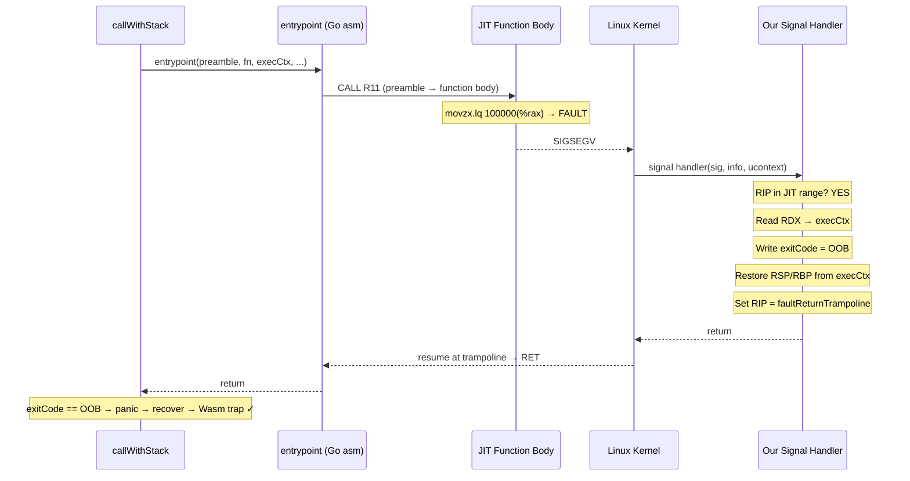

# Hardware Fault-to-Trap: Custom Signal Handler Approach

## Background

Go's panic recovery (`sigpanic` → `gopanic` → `recover`) fails for faults in JIT code because `findfunc(JIT_PC)` returns invalid — JIT code is mmap'd memory not registered in Go's `runtime.moduledata` function tables. The stack unwinder stops at the JIT frame, so `recover()` is never reached.

## Two Viable Approaches

### Approach A: Custom SIGSEGV Handler (Recommended)

Install our own SIGSEGV handler via raw `rt_sigaction` syscall + Go assembly. **No CGO, no vendored runtime code, no `//go:linkname` to fragile internals.**

This is the industry-standard approach used by Wasmtime, V8, SpiderMonkey, and every other production JIT engine.

### Approach B: `//go:linkname` into runtime moduledata

Use `//go:linkname` to access `runtime.lastmoduledatap` and register JIT code regions in Go's function tables so `findfunc()` succeeds. This would make Go's native `sigpanic` → `recover()` path work.

> [!WARNING]
> **Approach B is fragile**: `moduledata` is extraordinarily complex (ftab, pctab, pcsp delta tables, funcnametab, etc.) and changes between Go versions. Each Go upgrade would require re-verifying the structure layout. Approach A only depends on the stable Linux signal ABI.

## Detailed Design: Approach A

### How It Works

The wazevo preamble already saves the Go stack state before entering JIT:
- **RDX** = execution context pointer (callee-saved register `savedExecutionContextPtr`)
- **Offset 0** in exec ctx = `exitCode` (uint32)
- **Offset 16** in exec ctx = `originalFramePointer` (saved RBP)
- **Offset 24** in exec ctx = `originalStackPointer` (saved RSP)

When SIGSEGV occurs, the Linux kernel delivers the signal with full register state in a `ucontext_t`. The `sigcontext` struct (within `mcontext.gregs[23]`) contains all registers:

```
gregs[0..7]   = r8, r9, r10, r11, r12, r13, r14, r15
gregs[8..11]  = rdi, rsi, rbp, rbx
gregs[12..16] = rdx, rax, rcx, rsp, rip
```

Our handler:
1. Reads **RIP** from `sigcontext` (the faulting PC)
2. Checks if it's in a JIT code region (fast range check)
3. If **not JIT**: jumps to Go's saved handler (transparent forwarding)
4. If **JIT**:
   - Reads **RDX** from `sigcontext` → execution context pointer
   - Writes `ExitCodeMemoryOutOfBounds` (= 4) to `execCtx + 0` (exitCode field)
   - Reads saved RSP from `execCtx + 24` → writes to sigcontext RSP
   - Reads saved RBP from `execCtx + 16` → writes to sigcontext RBP
   - Sets sigcontext RIP to `faultReturnTrampoline` (a Go asm `RET` instruction)
   - Returns from signal handler

When the kernel restores the modified context:
- RSP/RBP point back to the Go stack (as if `CALL R11` in entrypoint never happened)
- RIP points to our trampoline which does `RET` → returns to caller of `entrypoint`
- `callWithStack` sees `exitCode == ExitCodeMemoryOutOfBounds` → `panic(ErrRuntimeOutOfBoundsMemoryAccess)` → recovered by existing defer

### Flow Diagram



## Proposed Changes

### Signal Handler (New Files)

#### [NEW] `internal/engine/wazevo/sighandler_linux_amd64.go`
- Go wrapper: stores JIT code ranges, Go's original handler, init logic
- Uses `syscall.RawSyscall6(SYS_RT_SIGACTION, ...)` to install handler
- Exports `RegisterJITCodeRange(start, end uintptr)` for engine to call
- Must be called after Go's runtime init but before any JIT execution

#### [NEW] `internal/engine/wazevo/sighandler_linux_amd64.s`
- Go assembly signal handler (~40 instructions)
- Reads ucontext registers, performs JIT PC range check
- On JIT fault: modifies ucontext, returns
- On non-JIT fault: jumps to Go's saved handler

#### [NEW] `internal/engine/wazevo/sighandler_stub.go`
- Build-tagged stub for unsupported platforms
- `RegisterJITCodeRange` is a no-op
- secureMode falls back to software bounds checks on unsupported platforms

---

### Engine Integration

#### [MODIFY] [engine.go](file:///mnt/faststorage/repos/se-wazero/internal/engine/wazevo/engine.go)
- After mmapping the code segment, call `RegisterJITCodeRange(codeStart, codeEnd)`
- Keep `memoryIsolationEnabled` = true when secureMode is active
- Remove the `DisableStackCheck` / `secureMode` parameter from `compileLocalWasmFunction`

#### [MODIFY] [call_engine.go](file:///mnt/faststorage/repos/se-wazero/internal/engine/wazevo/call_engine.go)
- Remove `debug.SetPanicOnFault(true)` (no longer needed)
- Remove the `runtime.Error` fault-detection logic in the defer
- Remove debug print statements
- The existing `ExitCodeMemoryOutOfBounds → panic(ErrRuntimeOutOfBoundsMemoryAccess)` path handles it

#### [MODIFY] [abi_entry_amd64.s](file:///mnt/faststorage/repos/se-wazero/internal/engine/wazevo/backend/isa/amd64/abi_entry_amd64.s)
- Revert from `CALL R11` back to `JMP R11` (the preamble handles the return)

---

### Interface Cleanup

#### [MODIFY] [compiler.go](file:///mnt/faststorage/repos/se-wazero/internal/engine/wazevo/backend/compiler.go)
- Remove `DisableStackCheck()` from Compiler interface

#### [MODIFY] Mock compilers (amd64/arm64 `util_test.go`)
- Remove `DisableStackCheck()` stubs

---

### Tests

#### [MODIFY] [secure_test.go](file:///mnt/faststorage/repos/se-wazero/secure_test.go)
- Remove debug prints
- Verify `secureMode=true` produces clean `ErrRuntimeOutOfBoundsMemoryAccess`
- Add subtest verifying the signal handler correctly distinguishes JIT vs non-JIT faults

#### [NEW] `internal/engine/wazevo/sighandler_test.go`
- Unit test for `RegisterJITCodeRange` / range check logic
- Integration test: mmap a page, make it PROT_NONE, verify fault in "registered" range is recovered

## Platform Support

| Platform | Signal Handler | Mechanism |
|---|---|---|
| Linux amd64 | ✅ `rt_sigaction` + Go asm | `sigcontext.gregs` in `ucontext_t` |
| Linux arm64 | ✅ Same approach | `sigcontext` has different register layout |
| macOS amd64 | ✅ `sigaction` + Go asm | `__darwin_mcontext64` register layout |
| macOS arm64 | ✅ Same approach | Different register layout |
| Windows amd64 | ✅ `AddVectoredExceptionHandler` | `CONTEXT` struct from Win32 |

> [!NOTE]
> Each platform needs its own `.s` file for the handler, but the Go-side logic (`RegisterJITCodeRange`, exit code handling) is shared. We should start with Linux amd64 and expand.

## Open Questions

> [!IMPORTANT]
> 1. **Handler installation timing**: Go's runtime installs its SIGSEGV handler during init. We need to install ours AFTER Go's init completes, and save Go's handler for forwarding. Should we use `init()` in the sighandler package, or an explicit `InstallSignalHandler()` call from the engine?
>
> 2. **Thread safety of JIT range registration**: Multiple modules may be compiled concurrently. The range check data structure needs to be lock-free or use atomic operations. A simple sorted list with `sync.RWMutex` should suffice — the handler reads are infrequent relative to JIT execution.
>
> 3. **Stack check disabling**: With hardware fault trapping working, do we still want to skip software bounds checks via `memoryIsolationEnabled`? Or keep both as defense-in-depth? (I recommend skipping software checks for the performance benefit — the guard pages are the primary mechanism.)

## Verification Plan

### Automated Tests
- `go test -v -run TestSecureMode ./` — End-to-end OOB fault-to-trap
- `go test ./internal/engine/wazevo/ -run TestSignalHandler` — Signal handler unit tests
- `go test ./internal/engine/wazevo/... ` — No regressions in existing tests
- `go test ./...` — Full suite

### Manual Verification
- Verify with `GOTRACEBACK=crash` that non-JIT SIGSEGVs still crash cleanly (handler forwarding works)
- Test on macOS once the darwin handler is implemented
