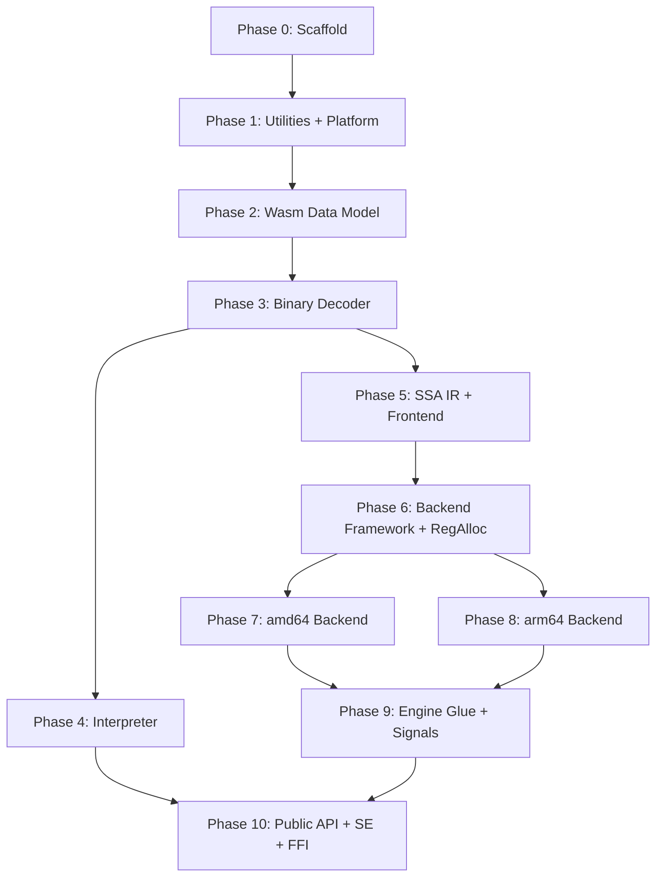

# Port se-wazero to Rust — Direct, Faithful, Complete

No Cranelift. No wasmparser. No LEB128 crate. Port every file.

---

## Complete Source Inventory

Every non-test Go source file, measured to the line.

### Public Surface

| Go Source | Prod LoC | Port To |
|---|---|---|
| `runtime.go` | 379 | `razero/src/runtime.rs` |
| `config.go` | 533 | `razero/src/config.rs` |
| `builder.go` | 380 | `razero/src/builder.rs` |
| `cache.go` | 108 | `razero/src/cache.rs` |
| **api/wasm.go** | 767 | `razero/src/api/wasm.rs` |
| **api/features.go** | 137 | `razero/src/api/features.rs` |
| **api/error.go** | 152 | `razero/src/api/error.rs` |
| **Subtotal** | **1,400 + 1,056 = 2,456** | |

### Experimental

| Go Source | Prod LoC | Port To |
|---|---|---|
| `experimental/*.go` (non-test, non-testdata) | 965 | `razero/src/experimental/*.rs` |
| Includes: snapshotter, yielder/resumer, function listener, fuel controller, memory allocator, table, close notifier | | |

### Internal: Wasm Data Model (`internal/wasm/`)

| Go Source | Prod LoC | Port To |
|---|---|---|
| `module.go` | 1,082 | `razero-wasm/src/module.rs` |
| `instruction.go` | 1,891 | `razero-wasm/src/instruction.rs` |
| `func_validation.go` | 2,378 | `razero-wasm/src/func_validation.rs` |
| `store.go` | 618 | `razero-wasm/src/store.rs` |
| `store_module_list.go` | 75 | `razero-wasm/src/store_module_list.rs` |
| `module_instance.go` | 239 | `razero-wasm/src/module_instance.rs` |
| `module_instance_lookup.go` | 85 | `razero-wasm/src/module_instance_lookup.rs` |
| `memory.go` | 475 | `razero-wasm/src/memory.rs` |
| `memory_definition.go` | 108 | `razero-wasm/src/memory_definition.rs` |
| `table.go` | 306 | `razero-wasm/src/table.rs` |
| `global.go` | 33 | `razero-wasm/src/global.rs` |
| `function_definition.go` | 175 | `razero-wasm/src/function_definition.rs` |
| `gofunc.go` → `hostfunc.go` | 206 | `razero-wasm/src/host_func.rs` |
| `host.go` | 194 | `razero-wasm/src/host.rs` |
| `engine.go` | 77 | `razero-wasm/src/engine.rs` |
| `const_expr.go` | 193 | `razero-wasm/src/const_expr.rs` |
| `counts.go` | 40 | `razero-wasm/src/counts.rs` |
| **Subtotal** | **8,362** (root) | |

### Internal: Binary Decoder (`internal/wasm/binary/`)

| Go Source | Prod LoC | Port To |
|---|---|---|
| `decoder.go` | ~200 | `razero-decoder/src/decoder.rs` |
| `section.go` | ~150 | `razero-decoder/src/section.rs` |
| `header.go` | ~40 | `razero-decoder/src/header.rs` |
| `code.go` | ~250 | `razero-decoder/src/code.rs` |
| `function.go` | ~30 | `razero-decoder/src/function.rs` |
| `import.go` | ~80 | `razero-decoder/src/import.rs` |
| `export.go` | ~40 | `razero-decoder/src/export.rs` |
| `memory.go` | ~30 | `razero-decoder/src/memory.rs` |
| `table.go` | ~40 | `razero-decoder/src/table.rs` |
| `global.go` | ~40 | `razero-decoder/src/global.rs` |
| `element.go` | ~100 | `razero-decoder/src/element.rs` |
| `data.go` | ~60 | `razero-decoder/src/data.rs` |
| `names.go` | ~150 | `razero-decoder/src/names.rs` |
| `custom.go` | ~30 | `razero-decoder/src/custom.rs` |
| `const_expr.go` | ~80 | `razero-decoder/src/const_expr.rs` |
| `limits.go` | ~30 | `razero-decoder/src/limits.rs` |
| `value.go` | ~80 | `razero-decoder/src/value.rs` |
| `errors.go` | ~30 | `razero-decoder/src/errors.rs` |
| **Subtotal** | **1,554** | |

### Internal: Interpreter Engine (`internal/engine/interpreter/`)

| Go Source | Prod LoC | Port To |
|---|---|---|
| `interpreter.go` | 4,879 | `razero-interp/src/interpreter.rs` |
| `compiler.go` | 3,675 | `razero-interp/src/compiler.rs` |
| `operations.go` | 2,845 | `razero-interp/src/operations.rs` |
| `signature.go` | 767 | `razero-interp/src/signature.rs` |
| `format.go` | 22 | `razero-interp/src/format.rs` |
| **Subtotal** | **12,188** | |

### Internal: Wazevo Compiler — SSA IR (`internal/engine/wazevo/ssa/`)

| Go Source | Prod LoC | Port To |
|---|---|---|
| `ssa.go` | — | `razero-compiler/src/ssa/mod.rs` |
| `builder.go` | — | `razero-compiler/src/ssa/builder.rs` |
| `basic_block.go` | — | `razero-compiler/src/ssa/basic_block.rs` |
| `basic_block_sort.go` | — | `razero-compiler/src/ssa/basic_block_sort.rs` |
| `instructions.go` | — | `razero-compiler/src/ssa/instructions.rs` |
| `pass.go` | — | `razero-compiler/src/ssa/pass.rs` |
| `pass_blk_layouts.go` | — | `razero-compiler/src/ssa/pass_blk_layouts.rs` |
| `pass_cfg.go` | — | `razero-compiler/src/ssa/pass_cfg.rs` |
| `signature.go` | — | `razero-compiler/src/ssa/signature.rs` |
| `type.go` | — | `razero-compiler/src/ssa/types.rs` |
| `vs.go` | — | `razero-compiler/src/ssa/vs.rs` |
| `cmp.go` | — | `razero-compiler/src/ssa/cmp.rs` |
| `funcref.go` | — | `razero-compiler/src/ssa/funcref.rs` |
| **Subtotal** | **5,676** | |

### Internal: Wazevo Compiler — Frontend (`internal/engine/wazevo/frontend/`)

| Go Source | Prod LoC | Port To |
|---|---|---|
| `frontend.go` | — | `razero-compiler/src/frontend/mod.rs` |
| `lower.go` | — | `razero-compiler/src/frontend/lower.rs` |
| `misc.go` | — | `razero-compiler/src/frontend/misc.rs` |
| `sort_id.go` | — | `razero-compiler/src/frontend/sort_id.rs` |
| **Subtotal** | **5,014** | |

### Internal: Wazevo Compiler — Backend Framework (`internal/engine/wazevo/backend/`)

| Go Source | Prod LoC | Port To |
|---|---|---|
| `backend.go` | — | `razero-compiler/src/backend/mod.rs` |
| `compiler.go` | — | `razero-compiler/src/backend/compiler.rs` |
| `compiler_lower.go` | — | `razero-compiler/src/backend/compiler_lower.rs` |
| `abi.go` | — | `razero-compiler/src/backend/abi.rs` |
| `go_call.go` → `host_call.go` | — | `razero-compiler/src/backend/host_call.rs` |
| `machine.go` | — | `razero-compiler/src/backend/machine.rs` |
| `vdef.go` | — | `razero-compiler/src/backend/vdef.rs` |
| **Subtotal** | **980** | |

### Internal: Wazevo Compiler — Register Allocator (`internal/engine/wazevo/backend/regalloc/`)

| Go Source | Prod LoC | Port To |
|---|---|---|
| `regalloc.go` | — | `razero-compiler/src/backend/regalloc/regalloc.rs` |
| `reg.go` | — | `razero-compiler/src/backend/regalloc/reg.rs` |
| `regset.go` | — | `razero-compiler/src/backend/regalloc/regset.rs` |
| `api.go` | — | `razero-compiler/src/backend/regalloc/api.rs` |
| **Subtotal** | **1,532** | |

### Internal: Wazevo Compiler — amd64 Backend (`internal/engine/wazevo/backend/isa/amd64/`)

| Go Source | Prod LoC | Port To |
|---|---|---|
| `machine.go` | — | `razero-compiler/src/backend/isa/amd64/machine.rs` |
| `machine_pro_epi_logue.go` | — | `razero-compiler/src/backend/isa/amd64/machine_pro_epi_logue.rs` |
| `machine_regalloc.go` | — | `razero-compiler/src/backend/isa/amd64/machine_regalloc.rs` |
| `machine_vec.go` | — | `razero-compiler/src/backend/isa/amd64/machine_vec.rs` |
| `instr.go` | — | `razero-compiler/src/backend/isa/amd64/instr.rs` |
| `instr_encoding.go` | — | `razero-compiler/src/backend/isa/amd64/instr_encoding.rs` |
| `abi.go` | — | `razero-compiler/src/backend/isa/amd64/abi.rs` |
| `abi_go_call.go` | — | `razero-compiler/src/backend/isa/amd64/abi_host_call.rs` |
| `abi_entry_amd64.go` | — | `razero-compiler/src/backend/isa/amd64/abi_entry.rs` |
| `abi_entry_preamble.go` | — | `razero-compiler/src/backend/isa/amd64/abi_entry_preamble.rs` |
| `lower_constant.go` | — | `razero-compiler/src/backend/isa/amd64/lower_constant.rs` |
| `lower_mem.go` | — | `razero-compiler/src/backend/isa/amd64/lower_mem.rs` |
| `operands.go` | — | `razero-compiler/src/backend/isa/amd64/operands.rs` |
| `reg.go` | — | `razero-compiler/src/backend/isa/amd64/reg.rs` |
| `stack.go` | — | `razero-compiler/src/backend/isa/amd64/stack.rs` |
| `cond.go` | — | `razero-compiler/src/backend/isa/amd64/cond.rs` |
| `ext.go` | — | `razero-compiler/src/backend/isa/amd64/ext.rs` |
| `abi_entry_amd64.s` | 106 | `razero-compiler/src/backend/isa/amd64/abi_entry.S` (global_asm!) |
| **Subtotal** | **11,669 + 106 asm** | |

### Internal: Wazevo Compiler — arm64 Backend (`internal/engine/wazevo/backend/isa/arm64/`)

| Go Source | Prod LoC | Port To |
|---|---|---|
| `machine.go` | — | `razero-compiler/src/backend/isa/arm64/machine.rs` |
| `machine_pro_epi_logue.go` | — | `razero-compiler/src/backend/isa/arm64/machine_pro_epi_logue.rs` |
| `machine_regalloc.go` | — | `razero-compiler/src/backend/isa/arm64/machine_regalloc.rs` |
| `machine_relocation.go` | — | `razero-compiler/src/backend/isa/arm64/machine_relocation.rs` |
| `instr.go` | — | `razero-compiler/src/backend/isa/arm64/instr.rs` |
| `instr_encoding.go` | — | `razero-compiler/src/backend/isa/arm64/instr_encoding.rs` |
| `abi.go` | — | `razero-compiler/src/backend/isa/arm64/abi.rs` |
| `abi_go_call.go` | — | `razero-compiler/src/backend/isa/arm64/abi_host_call.rs` |
| `abi_entry_arm64.go` | — | `razero-compiler/src/backend/isa/arm64/abi_entry.rs` |
| `abi_entry_preamble.go` | — | `razero-compiler/src/backend/isa/arm64/abi_entry_preamble.rs` |
| `lower_constant.go` | — | `razero-compiler/src/backend/isa/arm64/lower_constant.rs` |
| `lower_instr.go` | — | `razero-compiler/src/backend/isa/arm64/lower_instr.rs` |
| `lower_instr_operands.go` | — | `razero-compiler/src/backend/isa/arm64/lower_instr_operands.rs` |
| `lower_mem.go` | — | `razero-compiler/src/backend/isa/arm64/lower_mem.rs` |
| `reg.go` | — | `razero-compiler/src/backend/isa/arm64/reg.rs` |
| `cond.go` | — | `razero-compiler/src/backend/isa/arm64/cond.rs` |
| `unwind_stack.go` | — | `razero-compiler/src/backend/isa/arm64/unwind_stack.rs` |
| `abi_entry_arm64.s` | 124 | `razero-compiler/src/backend/isa/arm64/abi_entry.S` (global_asm!) |
| **Subtotal** | **11,581 + 124 asm** | |

### Internal: Wazevo Compiler — Engine Glue (`internal/engine/wazevo/` root)

| Go Source | Prod LoC | Port To |
|---|---|---|
| `engine.go` | — | `razero-compiler/src/engine.rs` |
| `engine_cache.go` | — | `razero-compiler/src/engine_cache.rs` |
| `call_engine.go` | — | `razero-compiler/src/call_engine.rs` |
| `module_engine.go` | — | `razero-compiler/src/module_engine.rs` |
| `hostmodule.go` | — | `razero-compiler/src/hostmodule.rs` |
| `memmove.go` | — | `razero-compiler/src/memmove.rs` |
| `entrypoint_amd64.go` | — | `razero-compiler/src/entrypoint_amd64.rs` |
| `entrypoint_arm64.go` | — | `razero-compiler/src/entrypoint_arm64.rs` |
| `entrypoint_other.go` | — | `razero-compiler/src/entrypoint_other.rs` |
| `isa_amd64.go` | — | `razero-compiler/src/isa_amd64.rs` |
| `isa_arm64.go` | — | `razero-compiler/src/isa_arm64.rs` |
| `isa_other.go` | — | `razero-compiler/src/isa_other.rs` |
| `sighandler_linux_amd64.go` | — | `razero-compiler/src/sighandler_linux_amd64.rs` |
| `sighandler_linux_arm64.go` | — | `razero-compiler/src/sighandler_linux_arm64.rs` |
| `sighandler_linux_amd64.s` | — | `razero-compiler/src/sighandler_linux_amd64.S` |
| `sighandler_linux_arm64.s` | — | `razero-compiler/src/sighandler_linux_arm64.S` |
| `sighandler_stub.go` | — | `razero-compiler/src/sighandler_stub.rs` |
| **Subtotal** | **3,230 + asm** | |

### Internal: Wazevo Compiler — wazevoapi (`internal/engine/wazevo/wazevoapi/`)

| Go Source | Prod LoC | Port To |
|---|---|---|
| `exitcode.go` | — | `razero-compiler/src/wazevoapi/exitcode.rs` |
| `offsetdata.go` | — | `razero-compiler/src/wazevoapi/offsetdata.rs` |
| `debug_options.go` | — | `razero-compiler/src/wazevoapi/debug_options.rs` |
| `pool.go` | — | `razero-compiler/src/wazevoapi/pool.rs` |
| `ptr.go` | — | `razero-compiler/src/wazevoapi/ptr.rs` |
| `queue.go` | — | `razero-compiler/src/wazevoapi/queue.rs` |
| `resetmap.go` | — | `razero-compiler/src/wazevoapi/resetmap.rs` |
| `perfmap.go` + variants | — | `razero-compiler/src/wazevoapi/perfmap.rs` |
| **Subtotal** | **902** | |

### Internal: Utilities

| Go Source | Prod LoC | Port To |
|---|---|---|
| `internal/leb128/` | 285 | `razero-wasm/src/leb128.rs` |
| `internal/ieee754/` | 29 | `razero-wasm/src/ieee754.rs` |
| `internal/moremath/` | 271 | `razero-wasm/src/moremath.rs` |
| `internal/u32/` + `internal/u64/` | 104 | `razero-wasm/src/u32.rs` + `u64.rs` |
| `internal/platform/` | 680 | `razero-platform/src/*.rs` |
| `internal/wasmruntime/` | 66 | `razero-wasm/src/wasmruntime.rs` |
| `internal/wasmdebug/` | 394 | `razero-wasm/src/wasmdebug.rs` |
| `internal/filecache/` | 118 | `razero/src/filecache.rs` |
| `internal/version/` | 58 | `razero/src/version.rs` |
| `internal/expctxkeys/` | 68 | `razero/src/ctx_keys.rs` |
| `internal/logging/` | 300 | `razero/src/logging.rs` |
| `internal/internalapi/` | 9 | (inlined into trait bounds) |
| `internal/assemblyscript/` | 39 | `razero/src/assemblyscript.rs` |
| `internal/secmem/` | 95 | `razero-secmem/src/lib.rs` |
| **Subtotal** | **2,516** | |

### C FFI

| Go Source | Prod LoC | Port To |
|---|---|---|
| `cmd/wazero-c/main.go` | 41 | `razero-ffi/src/lib.rs` |

---

### Grand Total — Production Code to Port

| Component | Go LoC |
|---|---|
| Public API + config + experimental | 3,421 |
| Wasm data model | 8,362 |
| Binary decoder | 1,554 |
| Interpreter engine | 12,188 |
| Compiler: SSA IR | 5,676 |
| Compiler: Frontend | 5,014 |
| Compiler: Backend framework | 980 |
| Compiler: Register allocator | 1,532 |
| Compiler: amd64 backend | 11,669 |
| Compiler: arm64 backend | 11,581 |
| Compiler: Engine glue | 3,230 |
| Compiler: wazevoapi | 902 |
| Assembly (4 files) | 230 |
| Utilities + platform | 2,516 |
| C FFI | 41 |
| **TOTAL** | **48,896** |

Plus **~52K LoC of tests** to port (or rewrite in `#[test]` style).

---

## Workspace Layout

```
se-razero/
├── Cargo.toml                 # workspace root
├── go.mod                     # co-exists until Go is deleted
│
├── razero/                    # public API crate (the "wazero" package equivalent)
│   └── src/
│       ├── lib.rs             # re-exports
│       ├── runtime.rs         # Runtime, NewRuntime
│       ├── config.rs          # RuntimeConfig, ModuleConfig, CompiledModule
│       ├── builder.rs         # HostModuleBuilder
│       ├── cache.rs           # CompilationCache
│       ├── filecache.rs       # file-backed cache
│       ├── version.rs
│       ├── logging.rs
│       ├── ctx_keys.rs        # expctxkeys equivalent (context/TypeMap keys)
│       ├── assemblyscript.rs
│       ├── api/
│       │   ├── mod.rs
│       │   ├── wasm.rs        # Module, Function, Memory, Global, ValueType
│       │   ├── features.rs    # CoreFeatures
│       │   └── error.rs       # sys.ExitError etc.
│       └── experimental/
│           ├── mod.rs
│           ├── snapshotter.rs
│           ├── yield.rs       # Yielder, Resumer, YieldError
│           ├── fuel.rs        # FuelController
│           ├── listener.rs    # FunctionListener
│           ├── memory.rs      # MemoryAllocator, LinearMemory
│           ├── table.rs
│           └── close_notifier.rs
│
├── razero-wasm/               # internal wasm data model
│   └── src/
│       ├── lib.rs
│       ├── module.rs
│       ├── instruction.rs     # opcode definitions (1,891 lines)
│       ├── func_validation.rs # bytecode validator (2,378 lines)
│       ├── store.rs
│       ├── store_module_list.rs
│       ├── module_instance.rs
│       ├── module_instance_lookup.rs
│       ├── memory.rs
│       ├── memory_definition.rs
│       ├── table.rs
│       ├── global.rs
│       ├── function_definition.rs
│       ├── host_func.rs       # was gofunc.go — Rust closure / trait object dispatch
│       ├── host.rs
│       ├── engine.rs          # Engine + ModuleEngine traits
│       ├── const_expr.rs
│       ├── counts.rs
│       ├── leb128.rs
│       ├── ieee754.rs
│       ├── moremath.rs
│       ├── u32.rs
│       ├── u64.rs
│       ├── wasmruntime.rs     # error sentinels
│       └── wasmdebug.rs       # DWARF stack traces
│
├── razero-decoder/            # binary format decoder
│   └── src/
│       ├── lib.rs
│       ├── decoder.rs
│       ├── section.rs
│       ├── header.rs
│       ├── code.rs
│       ├── function.rs
│       ├── import.rs
│       ├── export.rs
│       ├── memory.rs
│       ├── table.rs
│       ├── global.rs
│       ├── element.rs
│       ├── data.rs
│       ├── names.rs
│       ├── custom.rs
│       ├── const_expr.rs
│       ├── limits.rs
│       ├── value.rs
│       └── errors.rs
│
├── razero-interp/             # interpreter engine
│   └── src/
│       ├── lib.rs
│       ├── interpreter.rs     # core eval loop (4,879 lines)
│       ├── compiler.rs        # wasm→IR lowering (3,675 lines)
│       ├── operations.rs      # IR opcode definitions (2,845 lines)
│       ├── signature.rs       # fast host function dispatch (767 lines)
│       └── format.rs
│
├── razero-compiler/           # wazevo optimizing compiler — FULL PORT
│   └── src/
│       ├── lib.rs
│       ├── engine.rs
│       ├── engine_cache.rs
│       ├── call_engine.rs
│       ├── module_engine.rs
│       ├── hostmodule.rs
│       ├── memmove.rs
│       ├── entrypoint_amd64.rs
│       ├── entrypoint_arm64.rs
│       ├── entrypoint_other.rs
│       ├── isa_amd64.rs
│       ├── isa_arm64.rs
│       ├── isa_other.rs
│       ├── sighandler_linux_amd64.rs
│       ├── sighandler_linux_amd64.S   # global_asm!
│       ├── sighandler_linux_arm64.rs
│       ├── sighandler_linux_arm64.S   # global_asm!
│       ├── sighandler_stub.rs
│       │
│       ├── ssa/                       # SSA IR — full port
│       │   ├── mod.rs
│       │   ├── builder.rs
│       │   ├── basic_block.rs
│       │   ├── basic_block_sort.rs
│       │   ├── instructions.rs
│       │   ├── pass.rs
│       │   ├── pass_blk_layouts.rs
│       │   ├── pass_cfg.rs
│       │   ├── signature.rs
│       │   ├── types.rs
│       │   ├── vs.rs
│       │   ├── cmp.rs
│       │   └── funcref.rs
│       │
│       ├── frontend/                  # Wasm → SSA lowering
│       │   ├── mod.rs
│       │   ├── lower.rs
│       │   ├── misc.rs
│       │   └── sort_id.rs
│       │
│       ├── backend/                   # ISA-independent backend framework
│       │   ├── mod.rs
│       │   ├── compiler.rs
│       │   ├── compiler_lower.rs
│       │   ├── abi.rs
│       │   ├── host_call.rs
│       │   ├── machine.rs
│       │   ├── vdef.rs
│       │   │
│       │   ├── regalloc/              # register allocator
│       │   │   ├── mod.rs
│       │   │   ├── regalloc.rs
│       │   │   ├── reg.rs
│       │   │   ├── regset.rs
│       │   │   └── api.rs
│       │   │
│       │   └── isa/
│       │       ├── amd64/             # x86-64 machine backend — 22 files
│       │       │   ├── mod.rs
│       │       │   ├── machine.rs
│       │       │   ├── machine_pro_epi_logue.rs
│       │       │   ├── machine_regalloc.rs
│       │       │   ├── machine_vec.rs
│       │       │   ├── instr.rs
│       │       │   ├── instr_encoding.rs
│       │       │   ├── abi.rs
│       │       │   ├── abi_host_call.rs
│       │       │   ├── abi_entry.rs
│       │       │   ├── abi_entry_preamble.rs
│       │       │   ├── abi_entry.S     # global_asm!
│       │       │   ├── lower_constant.rs
│       │       │   ├── lower_mem.rs
│       │       │   ├── operands.rs
│       │       │   ├── reg.rs
│       │       │   ├── stack.rs
│       │       │   ├── cond.rs
│       │       │   └── ext.rs
│       │       │
│       │       └── arm64/             # AArch64 machine backend — 22 files
│       │           ├── mod.rs
│       │           ├── machine.rs
│       │           ├── machine_pro_epi_logue.rs
│       │           ├── machine_regalloc.rs
│       │           ├── machine_relocation.rs
│       │           ├── instr.rs
│       │           ├── instr_encoding.rs
│       │           ├── abi.rs
│       │           ├── abi_host_call.rs
│       │           ├── abi_entry.rs
│       │           ├── abi_entry_preamble.rs
│       │           ├── abi_entry.S     # global_asm!
│       │           ├── lower_constant.rs
│       │           ├── lower_instr.rs
│       │           ├── lower_instr_operands.rs
│       │           ├── lower_mem.rs
│       │           ├── reg.rs
│       │           ├── cond.rs
│       │           └── unwind_stack.rs
│       │
│       └── wazevoapi/
│           ├── mod.rs
│           ├── exitcode.rs
│           ├── offsetdata.rs
│           ├── debug_options.rs
│           ├── pool.rs
│           ├── ptr.rs
│           ├── queue.rs
│           ├── resetmap.rs
│           └── perfmap.rs
│
├── razero-platform/           # OS abstractions (mmap, cpu features, guard pages)
│   └── src/
│       ├── lib.rs
│       ├── mmap.rs
│       ├── mmap_linux.rs
│       ├── mmap_windows.rs
│       ├── mmap_other.rs
│       ├── cpu.rs
│       └── guard.rs
│
├── razero-secmem/             # guard-page memory allocator
│   └── src/
│       └── lib.rs
│
├── razero-ffi/                # C FFI boundary
│   └── src/
│       └── lib.rs
│
└── testdata/                  # existing .wasm/.wat files — untouched
```

---

## Phased Execution Plan

### Phase 0 — Scaffold
Create the workspace `Cargo.toml`, all crate directories, empty `lib.rs` stubs, and the inter-crate dependency graph. Establish the build. Everything compiles to nothing.

**Files created**: ~15 `Cargo.toml` + ~15 `lib.rs`
**Exit criterion**: `cargo build` succeeds.

---

### Phase 1 — Utilities & Platform
Port the small, dependency-free modules first. These are leaves in the dependency graph — everything else depends on them.

| File | Go LoC | Description |
|---|---|---|
| `leb128.rs` | 285 | LEB128 encode/decode |
| `ieee754.rs` | 29 | NaN canonicalization |
| `moremath.rs` | 271 | Math helpers (trunc, nearest, floor, ceil, copysign, min, max with NaN semantics) |
| `u32.rs` + `u64.rs` | 104 | Bit tricks |
| `wasmruntime.rs` | 66 | Error sentinel strings |
| `razero-platform/` | 680 | mmap, mprotect, munmap, CPU feature detection, guard page support queries |

**Exit criterion**: All utility crates compile and pass unit tests ported from Go.

---

### Phase 2 — Wasm Data Model (`razero-wasm`)
Port the spine of the runtime: the in-memory representation of a decoded, validated Wasm module, plus the Store and instantiation logic.

| File | Go LoC | Priority |
|---|---|---|
| `module.rs` | 1,082 | Module struct, sections, ID, metadata |
| `instruction.rs` | 1,891 | All Wasm opcode definitions |
| `func_validation.rs` | 2,378 | Bytecode validator (type-checks function bodies) |
| `engine.rs` | 77 | `Engine` + `ModuleEngine` traits |
| `store.rs` | 618 | Module registry, type ID interning |
| `store_module_list.rs` | 75 | Linked list of instantiated modules |
| `module_instance.rs` | 239 | Runtime module instance |
| `module_instance_lookup.rs` | 85 | Export lookup |
| `memory.rs` | 475 | `MemoryInstance` (grow, read, write, bounds) |
| `memory_definition.rs` | 108 | Memory export metadata |
| `table.rs` | 306 | `TableInstance` (funcref/externref tables, init, grow) |
| `global.rs` | 33 | `GlobalInstance` |
| `function_definition.rs` | 175 | `FunctionDefinition` export metadata |
| `host_func.rs` | 206 | Host function dispatch (trait objects replace Go reflection) |
| `host.rs` | 194 | Host module compilation |
| `const_expr.rs` | 193 | Constant expression evaluator |
| `counts.rs` | 40 | Import/export counting |
| `wasmdebug.rs` | 394 | DWARF-based stack trace formatting |

**Go → Rust translation notes**:
- `gofunc.go` used Go reflection to dispatch host functions. In Rust, this becomes `Box<dyn Fn(&mut Caller, &mut [u64])>` or a `HostFunc` trait object.
- `unsafe.Pointer` casts for funcref tables → raw pointers with `Send + Sync` bounds.
- `sync.Mutex` → `parking_lot::Mutex` (or `std::sync::Mutex`).
- `context.Context` → a `Context` struct carrying typed fields (no `interface{}` value bag). Or a `TypeMap`.

**Exit criterion**: `razero-wasm` compiles. Can construct a `Module` programmatically and instantiate it into a `Store`.

---

### Phase 3 — Binary Decoder (`razero-decoder`)
Port the binary format parser. This reads `.wasm` bytes and populates a `razero_wasm::Module`.

| File | Go LoC |
|---|---|
| All 18 files in `internal/wasm/binary/` | 1,554 |

Go uses `io.Reader` style pulling. Rust port uses `&[u8]` cursor with a position index — simpler, faster, no allocator pressure.

**Exit criterion**: Can decode every `.wasm` file in `testdata/`. Round-trip: decode → validate → confirm no errors for all valid modules.

---

### Phase 4 — Interpreter Engine (`razero-interp`)
Port the stack-machine interpreter. This is the first engine that can actually execute Wasm.

| File | Go LoC | Description |
|---|---|---|
| `compiler.rs` | 3,675 | Wasm bytecode → internal IR (opcode lowering, label resolution) |
| `operations.rs` | 2,845 | IR opcode enum + union operation struct |
| `interpreter.rs` | 4,879 | Core eval loop (`callNativeFunc`), host function dispatch, yield/resume |
| `signature.rs` | 767 | Fast-path host function call signatures |
| `format.rs` | 22 | Debug formatting |

**Go → Rust translation notes**:
- The `unionOperation` struct uses `uint64` fields as a poor man's tagged union. In Rust, this becomes a proper `enum Operation { ... }` with variants.
- The `callEngine` uses `panic`/`recover` for yield and snapshot. In Rust:
  - **Snapshot/Restore**: `catch_unwind` + `resume_unwind` (matching Go's semantics exactly).
  - **Yield/Resume**: same mechanism, or `Result`-based early return. We match Go's behavior first, optimize later.
- `unsafe.Pointer` for `functionFromUintptr` → raw pointer cast in `unsafe` block.

**Exit criterion**: Pass the WebAssembly spec test suite (v1 + v2) using the interpreter engine.

---

### Phase 5 — Compiler: SSA IR + Frontend (`razero-compiler` part 1)
Port the SSA intermediate representation and the Wasm → SSA lowering frontend.

| Component | Go LoC |
|---|---|
| SSA IR (`ssa/`) | 5,676 |
| Frontend (`frontend/`) | 5,014 |
| wazevoapi (`wazevoapi/`) | 902 |

**What this covers**:
- `ssa::Builder` — construct SSA IR from Wasm function bodies
- `ssa::Instruction` — SSA opcode set (loads, stores, arithmetic, control flow, memory ops)
- `ssa::BasicBlock` — block graph construction, dominator computation
- SSA passes: CFG ordering, block layout
- `frontend::Lower` — walk Wasm opcodes, emit SSA instructions
- `wazevoapi` — exit codes, offset data, pool/queue/resetmap utilities, perfmap integration

**Exit criterion**: Can lower every function in the spec test suite from Wasm to SSA IR and dump it for manual/automated verification.

---

### Phase 6 — Compiler: Backend Framework + Register Allocator
Port the ISA-independent backend compiler and the register allocator.

| Component | Go LoC |
|---|---|
| Backend framework (`backend/*.go` root) | 980 |
| Register allocator (`backend/regalloc/`) | 1,532 |

**What this covers**:
- `backend::Compiler` — drives SSA → machine instruction lowering
- `backend::Machine` trait — ISA-specific abstract interface
- ABI calling convention framework
- Register allocator: linear scan with spill/reload, register set management
- Virtual register → physical register mapping

**Exit criterion**: Backend compiles. Register allocator can allocate a simple function targeting any ISA.

---

### Phase 7 — Compiler: amd64 Backend
Port the x86-64 machine backend.

| Component | Go LoC |
|---|---|
| `backend/isa/amd64/` (17 `.go` files) | 11,669 |
| `abi_entry_amd64.s` | 106 |

**What this covers**:
- x86-64 instruction representation and encoding
- SSA → x86-64 instruction selection
- Prologue/epilogue generation
- Register allocation integration
- ABI entry trampoline (Go → JIT and JIT → Go calling conventions)
- Memory operand lowering
- SIMD/vector instruction support
- The `.s` assembly trampoline → Rust `global_asm!`

**Go → Rust translation notes**:
- Instruction encoding is manual byte emission. Port 1:1 — same byte sequences.
- Register definitions are constants. Map directly to Rust `const` or `enum`.
- `go:nosplit` / `go:noescape` pragmas → inline asm / `#[naked]` functions where needed.

**Exit criterion**: Can compile and execute a Wasm function on x86-64. Pass spec tests via the compiler engine on amd64.

---

### Phase 8 — Compiler: arm64 Backend
Port the AArch64 machine backend.

| Component | Go LoC |
|---|---|
| `backend/isa/arm64/` (17 `.go` files) | 11,581 |
| `abi_entry_arm64.s` | 124 |

Same structure as Phase 7 but for ARM64: instruction encoding, lowering, prologue/epilogue, relocation, stack unwinding.

**Exit criterion**: Pass spec tests via the compiler engine on arm64.

---

### Phase 9 — Compiler: Engine Glue + Signal Handlers
Port the engine-level glue that ties compilation, caching, module instantiation, and signal handling together.

| Component | Go LoC |
|---|---|
| Engine glue (`engine.go`, `engine_cache.go`, `call_engine.go`, `module_engine.go`, `hostmodule.go`) | ~3,230 |
| Signal handlers (`.go` + `.s`) | ~230 |
| Platform-conditional entrypoints | included above |

**What this covers**:
- `Engine` trait impl for the compiler
- Compilation cache (in-memory, keyed by module ID)
- `CallEngine` — manages the JIT call lifecycle, stack overflow detection
- `ModuleEngine` — resolves imports, creates function handles
- Custom SIGSEGV/SIGBUS handlers for hardware memory trapping
- Executable memory management (mmap RWX pages)

**Exit criterion**: Full compiler engine works end-to-end. Both interpreter and compiler engines pass spec tests.

---

### Phase 10 — Public API + SE Features + C FFI
Wire everything together into the user-facing crate.

| Component | Go LoC |
|---|---|
| Public API (`razero/src/`) | 2,456 |
| Experimental APIs | 965 |
| `razero-secmem` (guard page allocator) | 95 |
| `razero-ffi` (C FFI) | 41 |

**What this covers**:
- `Runtime::new()`, `Runtime::compile()`, `Runtime::instantiate()` 
- `RuntimeConfig` builder (features, memory limits, secure mode, fuel, close-on-context-done)
- `ModuleConfig` (name)
- `HostModuleBuilder` 
- `CompiledModule` / `Instance` / `Func` / `Memory` / `Global`
- Secure mode: `GuardPageAllocator` injection
- Fuel metering: wired through `RuntimeConfig` → `Engine::CompileModule`
- Yield/Resume: `Yielder` + `Resumer` traits, wired into both engines
- C FFI: `#[no_mangle] extern "C"` exports, opaque handle types, `cbindgen`-generated header
- `context.Context` equivalent: a `Context` struct or `TypeMap`-based bag for function listeners, snapshotters, fuel controllers, yielders

**Exit criterion**: The Rust `razero` crate has the same API surface as the Go `wazero` package. The C FFI produces the same `.a`/`.so` as the Go `c-archive`. All spec tests pass through the public API.

---

## Dependency Graph



- Phases 4 (interpreter) and 5-9 (compiler) are **parallel tracks** after Phase 3.
- Phases 7 (amd64) and 8 (arm64) are **parallel** after Phase 6.

---

## Go → Rust Translation Patterns

These apply across the entire port:

| Go Pattern | Rust Equivalent |
|---|---|
| `interface{}` | `dyn Any` or concrete enum |
| `context.Context` with value bag | `Context` struct with typed fields, or `anymap::Map` |
| `sync.Mutex` | `std::sync::Mutex` or `parking_lot::Mutex` |
| `sync/atomic` | `std::sync::atomic` |
| `panic(sentinel)` / `recover()` | `std::panic::catch_unwind` / `resume_unwind` |
| `unsafe.Pointer` casts | `*const T` / `*mut T` in `unsafe {}` |
| `go:nosplit` / `go:noescape` | `#[naked]` or `global_asm!` |
| Go `.s` assembly | Rust `global_asm!` with the same instructions |
| Build tags (`//go:build linux && amd64`) | `#[cfg(all(target_os = "linux", target_arch = "x86_64"))]` |
| `error` return | `Result<T, Error>` |
| Goroutine-per-call model | Direct call (Rust doesn't need goroutine workarounds) |
| `fmt.Errorf("...: %w", err)` | `thiserror` derive or manual `Display` + `source()` |
| Slice tricks (`append`, `cap`) | `Vec::push`, `Vec::with_capacity`, `Vec::truncate` |

---

## External Dependencies (Minimal)

These are the only external crates used. Everything else is ported from Go.

| Crate | Purpose |
|---|---|
| `thiserror` | Error derive macros |
| `parking_lot` | Fast mutexes (optional — can use `std::sync::Mutex`) |
| `libc` | Raw syscall bindings for mmap/mprotect/sigaction |
| `memmap2` or raw `libc::mmap` | Executable memory pages for JIT (can be raw libc) |
| `cbindgen` (build dep) | C header generation for FFI |

> [!NOTE]
> No `cranelift`. No `wasmparser`. No `wasm-encoder`. No `leb128`. The SSA IR, register allocator, instruction encoding, LEB128 — all ported from the Go source.

---

## Open Questions

> [!IMPORTANT]
> **1. Crate name**: `razero`? `se_razero`? Something else? Rust crate names use underscores.
> **Response**: `razero`.

> [!IMPORTANT]
> **2. `context.Context` replacement**: Go's `context.Context` is pervasive. Two options:
> - **Typed struct**: A `Context` struct with optional fields for each contextual value (fuel controller, function listener factory, yielder, snapshotter, close notifier, memory allocator). Simple, fast, but changes shape when new context keys are added.
> - **TypeMap**: An `AnyMap`-style type-indexed map, matching Go's `context.WithValue` semantics exactly. More flexible, slight runtime cost.
> Which do you prefer?
> **Response**: Typed struct.

> [!IMPORTANT]
> **3. Yield/Resume mechanism**: Go uses `panic`/`recover`. Rust options:
> - **`catch_unwind`/`resume_unwind`**: Closest to Go semantics. Works, but requires all types crossing the unwind boundary to be `UnwindSafe`.
> - **`Result`-based propagation**: More idiomatic Rust. The interpreter loop returns `Err(Yield { ... })` instead of panicking. Cleaner, no `UnwindSafe` hassles, but means changing the control flow structure of the interpreter (every call site must `?`-propagate).
> First port can use `catch_unwind` for fidelity, then refactor to `Result` later. Sound good?
> **Response**: Yes, use `catch_unwind` and we'll switch to `Result` later.

## Verification Plan

### Automated Tests
1. **Spec test suite** (per-phase): `cargo test --test spec_v1`, `cargo test --test spec_v2`, `--test extended_const`, `--test tail_call`, `--test threads`
2. **Unit tests**: port every `*_test.go` file alongside its source, phase by phase
3. **Interpreter conformance**: all spec tests pass via `razero-interp`
4. **Compiler conformance**: all spec tests pass via `razero-compiler` on both amd64 and arm64
5. **C FFI smoke test**: compile + link a C program against `razero.h` + `librazero.a`
6. **Fuel exhaustion**: infinite loop terminates deterministically
7. **Guard page**: OOB access traps without host crash
8. **Yield/resume**: cooperative suspension round-trips correctly
9. **Secure mode benchmark**: compare vs Go implementation on representative workload

### Manual Verification
- Cross-compile C FFI for linux-amd64 and linux-arm64
- Run a real module from the hjrt platform through both engines
